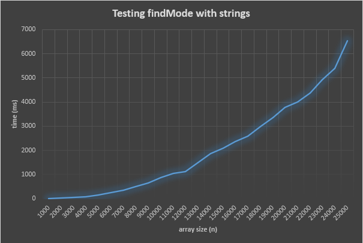
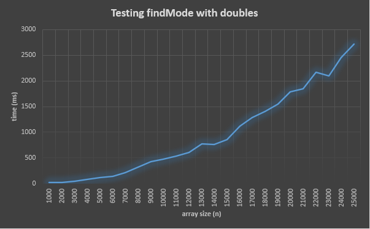

# Kurssitehtävien oppima ja raportit

Kirjoita jokaisesta alla olevasta kurssitehtävästä parilla lauseella miten tehtävän tekeminen sujui ja mitä siitä opit.

Jos tehtävässä pyydetään **raportoimaan** jotain, kirjoita myös nämä raportit tähän dokumenttiin.

## 00-init

## 01-arrays

## 02-mode

Koska sort()-metodissa käydään taulukko läpi sisäkkäisissä silmukoissa, on sen aikakompleksisuus O(n^2). findMode()-metodin aikakompleksisuus on ilman sort():a O(n), koska siinä on vain yksi silmukka, missä käydään listan alkiot läpi. Lopullinen aikakompleksisuus findMode():lle on O(n^2). 

## 03-draw

## 04-1-stack

## 04-2-queue

## 04-3-linkedlist

## 05-binsearch

## 05-invoices

## 67-phonebook

Tähän tehtävään liittyy raportti! Lue ohjeet!

## Valinnaiset tehtävät

Jos teit jotain valinnaisia tehtäviä, mainitse se täällä että ne tulevat varmasti arvioiduksi.

# Yleistä koko kurssista ja kurssin tehtävistä

Yleistä palautetta ja kehitysehdotuksia, kiitos!