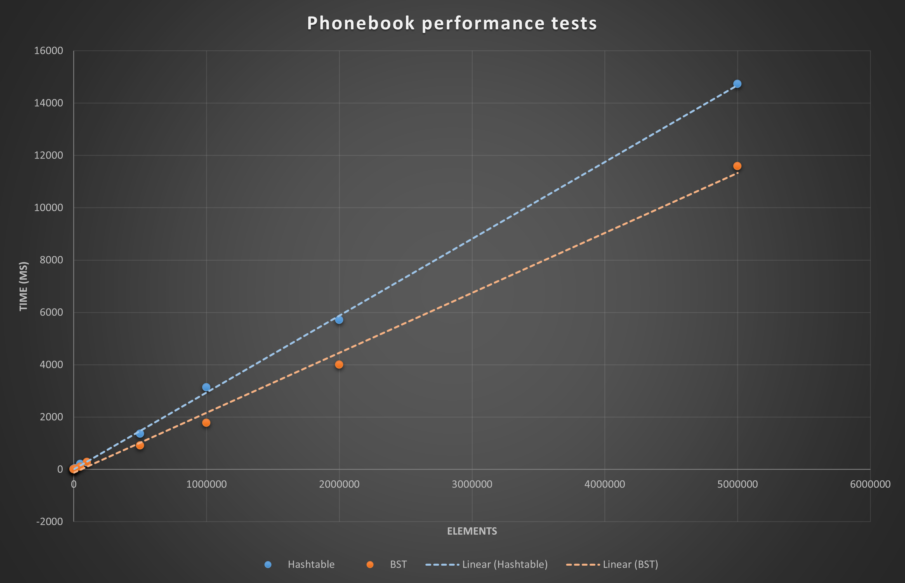

# Kurssitehtävien oppima ja raportit

Kirjoita jokaisesta alla olevasta kurssitehtävästä parilla lauseella miten tehtävän tekeminen sujui ja mitä siitä opit.

Jos tehtävässä pyydetään **raportoimaan** jotain, kirjoita myös nämä raportit tähän dokumenttiin.

## 00-init
Työkalujen asennus ja toiminnan tarkistaminen oli melko suoraviivaista ja sujui hyvin.

## 01-arrays
Javan syntaksi alkoi tulla tutummaksi ja harjoituksen algoritmien kehittäminen oli helppoa.

## 02-mode

Koska sort()-metodissa käydään taulukko läpi sisäkkäisissä silmukoissa, on sen aikakompleksisuus O(n^2). findMode()-metodin aikakompleksisuus on ilman sort():a O(n), koska siinä on vain yksi silmukka, missä käydään listan alkiot läpi. Lopullinen aikakompleksisuus findMode():lle on O(n^2). 

## 03-draw
Harjoituksen liittymäpinta pelimaailmaan oli avaamaan algoritmien käytön todellisuutta ja tuomaan motivaatiota ohjelmointiin. Tehtävän teko sujui melkolailla ongelmitta.

## 04-1-stack
Kurssimateriaalin pseudokoodit olivat suurena apuna tietorakenteen toteuttamisessa. Tämäkin tehtävä sujui loppupeleissä hyvinkin kivuttomasti.

## 04-2-queue
Tämä harjoitus sujui samoin kuin stack.

## 04-3-linkedlist
Linkitetyssä listassa oli välillä hankaluuksia, mutta ne osoittautuivat lopulta vain hyvin pieniksi, mutta vaikeasti havaittaviksi bugeiksi.

## 05-binsearch
Jälleen kurssimateriaalin pseudokoodit auttoivat ja tehtävä oli melko suoraviivainen.

## 05-invoices
Algoritmin kehittäminen ja aiempien algoritmien hyödyntäminen tuotti vaikeuksia, ja ensin toteutin naiivin toteutuksen vain paljon monimutkaisemmin. Lopulta pienen tauon jälkeen uusin silmin katsottuna tehtävä meni yllättävänkin helposti. Kekolajittelun toteutus antoi hyvää oppia lajittelusta.

## 67-phonebook

Kokeilin muutamia erilaisia hajautusfunktioita, mutta pääosin ratkaisut olivat joko ihan hyviä tai tosi huonoja. Eli törmäyksiä tuli hajautustaulussa esimerkiksi large-town aineistolla noin 23000 ja cityllä 83000 aina, kun hajautusfunktio oli ihan hyvä, mutta kun se oli huono törmäyksiä saattoi tulla 2 kertaa aineiston elementtien määrä. Mitään väimallin tuloksia ei tullut kuin ihan parilla eri alkuluku ja bittisiirto kombinaatiolla. Vertasin hajautusfunktion toteutustani myös Javan omaan hashCodeen ja tulokset olivat hyvin samanlaisia törmäysten ja nopeuden suhteen.
Kokeilin esimerkiksi jdb2 tyyppistä ratkaisua, mutta se ei antanut mitään uutta. Viimeisessä toteutuksessa hyödynsin erästä netistä löytynyttä tyyliä, mutta bittisiirtoakaan en lopulta käyttänyt, koska en saanut siitä mitään hyötyä.

Täyttöasteina kokeilin 80%, 70%, 65%, 60% ja päädyin lopulta 65%, mikä on mielestäni sopiva kompromissi. Jälleen törmäysten määrä nousi todella suureksi esimerkiksi 80 prosentin täytöllä 60-70% törmäysten määrä oli melko tasainen.

Aluksi kasvatin taulukon koon aina 1,5-kertaiseksi, mutta vaihdoin sitten `capacity * (1.0 / LOAD_FACTOR)`, eli samaan mitä C++ demossa käytettiin. Tällä ratkaisulla täyttöprosentti oli 45-65 testien lopuksi. 1,5 kertoimella täyttöprosentti pyöri 44 ja 60 välillä.

Binäärihakupuun suurin syvyys megalopolis-aineistolla on 60, mikä on kyllä melko paljon suhteutettuna siihen, että kaikki 5 miljoonaa elementtiä mahtuisi helposti jo 22 syvään puuhun. Tämä lukema ei tuntunut laskevan vaikka hajautusfunktiota muutteli.

Hajautustaulussa käsittelin törmäykset avoimella osoittamisella ja luotaamisella. Tämä vaikutti kätevämmältä tavalta luentojen perusteella, joten toteutin sen. Puussa käytin törmäysten käsittelyyn myös avointa osoittamista, tosin käytin kiinteää hashmodifieria. Mietin linkitetyn listan kokeilemista molemmissa, mutta ajan puutteen vuoksi jätin kokeilematta. Hakupuun toteutuksen ja törmäysten käsittelyn oikeellisuudesta en ole aivan varma, vaikka testit menevätkin kirkkaasti läpi. Tai ehkä pikemminkin kyse on tehokkuudesta kuin oikeellisuudesta.

Hajautustaululle tulostan kapasiteetin, elementtien määrän, täyttöprosentin, törmäysten määrän, maksimiluotauksen ja uudelleen allokointien määrän. BST:ssä elementtien määrän, maksimisyvyyden ja törmäysten maksimimäärän. Eniten eroja aiemmin kokeilemieni toteutusten ja palautetun välillä oli selvästi törmäyksissä hajautusfunktiota muuttaessa. Tämä toki vain hajautustaulussa. Puussa en huomannut tulostamissani tiedoissa kovin suuria eroja. 

Toteutin 05:ssa heapsortin, mikä luentojen ja netin perusteella sopi tarkoitukseen parhaiten tasaisen aikakompleksisuuden vuoksi ja käytin sitä myös tässä harjoituksessa. En joutunut kasvattamaan pinon tai keon kokoa.

# Yleistä koko kurssista ja kurssin tehtävistä

Tämä kurssi tarjoaa kyllä erittäin hyvää oppia aiheistaan ja harjoitukset tuovat paljon hands-on kokemusta. Mitään huonoa palautetta ei tule mieleen, eli kurssin järjestelyt on toteutettu toimivasti! Viime vuoden toteutukseen verrattuna uusi 03-draw tehtävä toi hyvän monille tutun ns. oikean elämän näkökulman tehokkaiden algoritmien hyödyntämiseen.